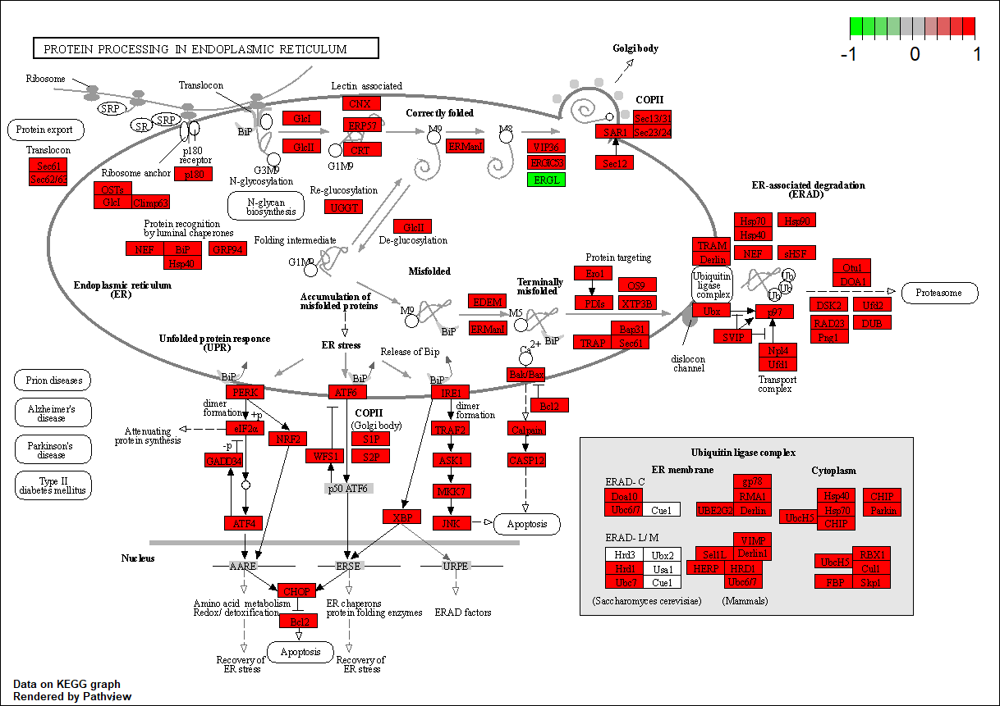

```{r setup, include=FALSE}
knitr::opts_chunk$set(echo = TRUE)
```

# Data processing
### Including the libraries

```{r}
library(ggplot2)
library(pheatmap)
library("TCGAbiolinks")
library("survival")
library("survminer")
library("SummarizedExperiment")
library(DESeq2)
library("gridExtra")
library("AnnotationDbi")
library("org.Hs.eg.db")
library(pathview)
library(gage)
```

### Opening the datafiles
```{r}
data_mutation = read.delim("data_mutations.txt", header = TRUE, sep = '\t')
data_clinical = read.table("data_clinical_patient.txt",header = TRUE, sep = '\t')
data_rna = read.csv("RNAseq_LIHC.csv", header = TRUE, row.names = "X")
```

### Finding the patients that we have data for clinical, genome, and RNAseq data
```{r}
unique_patient_clinical = unique(data_clinical$PATIENT_ID)
unique_patient_rna = unique(colnames(data_rna))
unique_patient_mutation = unique(data_mutation$Tumor_Sample_Barcode)

shortened_rna = substr(unique_patient_rna, start = 1, stop = 12)
shortened_rna = gsub("\\.", "-", shortened_rna)

shortened_mutation = substr(unique_patient_mutation, start = 1, stop = 12)

common_names1 <- intersect(unique_patient_clinical, shortened_mutation)
common_names2 <- intersect(common_names1, shortened_rna)

```

###  Adding the patient ID at the last column and get the common datas
```{r}
data_clinical_common = subset(data_clinical, PATIENT_ID %in% common_names2)

data_mutation$PATIENT_ID = substr(data_mutation$Tumor_Sample_Barcode, start = 1, stop = 12)
data_mutation_common = subset(data_mutation, PATIENT_ID %in% common_names2)

data_mutation_common$Tumor_Sample_Barcode = data_mutation_common$PATIENT_ID

data_rna_shortened = data_rna
colnames(data_rna_shortened) = substr(colnames(data_rna_shortened), start = 1, stop = 12)
colnames(data_rna_shortened) = gsub("\\.", "-", colnames(data_rna_shortened))
data_rna_common = data_rna_shortened[,common_names2]

```

# Analysis of mutation data

Generate a plot for distribution of variant classifications
```{r}
data_oncoplot = data_mutation_common

hugo <- as.data.frame(table(data_oncoplot$Hugo_Symbol))
var.class <- as.data.frame(table(data_oncoplot$Variant_Classification))
ggplot(data=var.class, aes(x=Var1, y=Freq))+
  geom_col()+
  theme(axis.text.x = element_text(angle = 45,hjust=1))
```
Generate a plot for distribution of mutation events
```{r}
hugo <- as.data.frame(table(data_mutation_common$Hugo_Symbol))

hugo.ordered <- hugo[order(-hugo$Freq),]

ggplot(data=hugo.ordered[1:20,], aes(x=Var1, y=Freq))+
  geom_col()+
  theme(axis.text.x = element_text(angle = 45,hjust=1))+
  scale_x_discrete(limits = hugo.ordered[1:20,]$Var1)
```
Generate an oncoplot matrix of all genes
```{r}
cnv_events = unique(data_oncoplot$Variant_Classification)
oncomat = reshape2::dcast(
  data = data_oncoplot,
  formula = Hugo_Symbol ~ Tumor_Sample_Barcode,
  fun.aggregate = function(x, cnv = cnv_events) {
    x = as.character(x) # >= 2 same/distinct variant classification = Multi_Hit
    xad = x[x %in% cnv]
    xvc = x[!x %in% cnv]
    
    if (length(xvc) > 0) {
      xvc = ifelse(test = length(xvc) > 1,
                   yes = 'Multi_Hit',
                   no = xvc)
    }
    
    x = ifelse(
      test = length(xad) > 0,
      yes = paste(xad, xvc, sep = ';'),
      no = xvc
    )
    x = gsub(pattern = ';$',
             replacement = '',
             x = x)
    x = gsub(pattern = '^;',
             replacement = '',
             x = x)
    return(x)
  },
  value.var = 'Variant_Classification',
  fill = '',
  drop = FALSE
)

rownames(oncomat) = oncomat$Hugo_Symbol
oncomat <- oncomat[,-1]

oncomat.ordered <- oncomat[order(-hugo$Freq),]
```

Transform the matrix into a binary matrix
```{r}
mat <- oncomat.ordered
mat[mat== "Silent"] = 0
mat[mat == "Intron"] = 0
mat[mat == "Missense_Mutation"] = 0
mat[mat == ""] = 0

mat <- apply(mat, 2 ,as.numeric)
mat <- as.matrix(mat)
mat[is.na(mat)]=1

rownames(mat)  <-  row.names(oncomat.ordered)
```
Finding the top 20 most mutated genes
```{r}
genes = rowSums(mat)
genes.ordered = sort(genes, decreasing = TRUE)


genes.ordered.top = genes.ordered[1:20]
genes.ordered.top.names = names(genes.ordered.top)

data_oncoplot.top = subset(data_oncoplot, Hugo_Symbol %in% genes.ordered.top.names)

```

Making a matrix of the top 20 mutated genes
```{r}
cnv_events = unique(data_oncoplot.top$Variant_Classification)
oncomat.top = reshape2::dcast(
  data = data_oncoplot.top,
  formula = Hugo_Symbol ~ Tumor_Sample_Barcode,
  fun.aggregate = function(x, cnv = cnv_events) {
    x = as.character(x) # >= 2 same/distinct variant classification = Multi_Hit
    xad = x[x %in% cnv]
    xvc = x[!x %in% cnv]
    
    if (length(xvc) > 0) {
      xvc = ifelse(test = length(xvc) > 1,
                   yes = 'Multi_Hit',
                   no = xvc)
    }
    
    x = ifelse(
      test = length(xad) > 0,
      yes = paste(xad, xvc, sep = ';'),
      no = xvc
    )
    x = gsub(pattern = ';$',
             replacement = '',
             x = x)
    x = gsub(pattern = '^;',
             replacement = '',
             x = x)
    return(x)
  },
  value.var = 'Variant_Classification',
  fill = '',
  drop = FALSE
)
hugo <- as.data.frame(table(data_oncoplot.top$Hugo_Symbol))

rownames(oncomat.top) = oncomat.top$Hugo_Symbol
oncomat.top <- oncomat.top[,-1]
oncomat.top.ordered <- oncomat.top[order(-hugo$Freq),]
```

Generate a plot for distribution of the top 20 most mutated genes
```{r}
hugo.ordered <- hugo[order(-hugo$Freq),]
ggplot(hugo.ordered, aes(x=Var1, y=Freq))+
  geom_col()+
  theme(axis.text.x = element_text(angle = 45,hjust=1))+
  scale_x_discrete(limits = hugo.ordered$Var1)
```

Transforming the top 20 gene matrix into binary
```{r, echo = FALSE}
mat.top <- oncomat.top.ordered
mat.top[mat.top== "Silent"] = 0
mat.top[mat.top == "Intron"] = 0
mat.top[mat.top == "Missense_Mutation"] = 0

mat.top[mat.top == ""] = 0


mat.top <- apply(mat.top, 2 ,as.numeric)
mat.top <- as.matrix(mat.top)
mat.top[is.na(mat.top)]=1

rownames(mat.top)  <-  row.names(oncomat.top.ordered)
```

Generate a pheatmap for top 3 mutated genes
```{r}
reduce.mat <- mat.top[1:3,]
res <- pheatmap(reduce.mat,
         cluster_rows = FALSE,
         show_colnames = FALSE, main = "Top 3 gene mutation vs patient")
```
Performing k-mean clustering
```{r}
cluster = as.data.frame(cutree(res$tree_col, k = 2))
cluster
```

Finding the patientID in each group
```{r}
mutation_group1_patientID = subset(cluster,`cutree(res$tree_col, k = 2)` == 1)
mutation_group2_patientID = subset(cluster,`cutree(res$tree_col, k = 2)` == 2)

data_clinical_common_group1 = subset(data_clinical_common,PATIENT_ID %in% rownames(mutation_group1_patientID))

data_clinical_common_group2 = subset(data_clinical_common,PATIENT_ID %in% rownames(mutation_group2_patientID))

mutation_TP53_patientID = data_mutation_common$PATIENT_ID[data_mutation_common$Hugo_Symbol == "TP53"]

data_clinical_common_TP53 = subset(data_clinical_common, PATIENT_ID %in% mutation_TP53_patientID)

```

# Survival analysis

## survival analysis (SA) on clinical data 
```{r}
data_clinical_common$deceased = data_clinical_common$PFS_STATUS == "1:PROGRESSION"

# create an "overall survival" variable that is equal to days_to_death
# for dead patients, and to days_to_last_follow_up for patients who
# are still alive
data_clinical_common$overall_survival = ifelse(data_clinical_common$deceased,
                                   data_clinical_common$OS_MONTHS,
                                   data_clinical_common$DAYS_LAST_FOLLOWUP)
```

### SA by cluster

```{r}
# Adding a cluster annotation column

data_clinical_common$cluster = cluster[data_clinical_common$PATIENT_ID,]

Surv(data_clinical_common$overall_survival, data_clinical_common$deceased) ~ data_clinical_common$cluster

table(data_clinical_common$cluster)
fit = survfit(Surv(overall_survival, deceased) ~ cluster, data = data_clinical_common)

pval = surv_pvalue(fit, data=data_clinical_common)$pval
print(pval)

ggsurvplot(fit, data=data_clinical_common, pval=T, risk.table=T, risk.table.col="strata", risk.table.height=0.35, title="Survival analysis of patients by cluster with mutation data")
```


### SA by sex
```{r}
Surv(data_clinical_common$overall_survival, data_clinical_common$deceased) ~ data_clinical_common$SEX

table(data_clinical_common$SEX)
fit = survfit(Surv(overall_survival, deceased) ~ SEX, data = data_clinical_common)

pval = surv_pvalue(fit, data=data_clinical_common)$pval
print(pval)

ggsurvplot(fit, data=data_clinical_common, pval=T, risk.table=T, risk.table.col="strata", risk.table.height=0.35, title = "Survival analysis of patients by sex")

```
### SA by Tumor Stage
```{r}
# remove any of the letters "a", "b" or "c", but only if they are at the end
# of the name, eg "stage iiia" would become simply "stage iii"
data_clinical_common$AJCC_PATHOLOGIC_TUMOR_STAGE = gsub("[ABC]$", "", data_clinical_common$AJCC_PATHOLOGIC_TUMOR_STAGE)

	
data_clinical_common[which(data_clinical_common$AJCC_PATHOLOGIC_TUMOR_STAGE == ""), "AJCC_PATHOLOGIC_TUMOR_STAGE"] = NA

table(data_clinical_common$AJCC_PATHOLOGIC_TUMOR_STAGE)

fit = survfit(Surv(overall_survival, deceased) ~ AJCC_PATHOLOGIC_TUMOR_STAGE, data=data_clinical_common)

# we can extract the survival p-value and print it
pval = surv_pvalue(fit, data=data_clinical_common)$pval
print(pval)
ggsurvplot(fit, data=data_clinical_common, pval=T,pval.size = 3 ,risk.table=T, risk.table.height=0.39,legend.lab = c("STAGE I", "STAGE II", "STAGE III", "STAGE IV"), title = "Survival analysis of patients by tumor stage", title.fontsize = 2)
```
## Survival analysis on patients in each cluster (produced by mutation data)
### SA on cluster 1 by Tumor Stage 
```{r}
data_clinical_common_group1$deceased = data_clinical_common_group1$PFS_STATUS == "1:PROGRESSION"

# create an "overall survival" variable that is equal to days_to_death
# for dead patients, and to days_to_last_follow_up for patients who
# are still alive
data_clinical_common_group1$overall_survival = ifelse(data_clinical_common_group1$deceased,
                                   data_clinical_common_group1$OS_MONTHS,
                                   data_clinical_common_group1$DAYS_LAST_FOLLOWUP)

# remove any of the letters "a", "b" or "c", but only if they are at the end
# of the name, eg "stage iiia" would become simply "stage iii"
data_clinical_common_group1$AJCC_PATHOLOGIC_TUMOR_STAGE = gsub("[ABC]$", "", data_clinical_common_group1$AJCC_PATHOLOGIC_TUMOR_STAGE)

data_clinical_common_group1[which(data_clinical_common_group1$AJCC_PATHOLOGIC_TUMOR_STAGE == ""), "AJCC_PATHOLOGIC_TUMOR_STAGE"] = NA

table(data_clinical_common_group1$AJCC_PATHOLOGIC_TUMOR_STAGE)

fit = survfit(Surv(overall_survival, deceased) ~ AJCC_PATHOLOGIC_TUMOR_STAGE , data=data_clinical_common_group1)

# we can extract the survival p-value and print it
pval = surv_pvalue(fit, data=data_clinical_common_group1)$pval
print(pval)

ggsurvplot(fit, data=data_clinical_common_group1, pval=T, risk.table=T, risk.table.col="strata", risk.table.height=0.45,legend.lab = c("STAGE I", "STAGE II", "STAGE III", "STAGE IV"), title = "Survivability of cluster 1 patients by tumor stage")
```

### SA on cluster 1 by Sex
```{r}
Surv(data_clinical_common_group1$overall_survival, data_clinical_common_group1$deceased) ~ data_clinical_common_group1$SEX

fit = survfit(Surv(overall_survival, deceased) ~ SEX, data = data_clinical_common_group1)

table(data_clinical_common_group1$SEX)

pval = surv_pvalue(fit, data=data_clinical_common_group1)$pval
print(pval)
ggsurvplot(fit, data=data_clinical_common_group1, pval=T, risk.table=T, risk.table.col="strata", risk.table.height=0.35, legend.lab = c("Female", "Male"), title = "Survivability of cluster 1 patients by sex")
```

### SA on cluster 2 Tumor stage 
```{r}
data_clinical_common_group2$deceased = data_clinical_common_group2$PFS_STATUS == "1:PROGRESSION"

# create an "overall survival" variable that is equal to days_to_death
# for dead patients, and to days_to_last_follow_up for patients who
# are still alive
data_clinical_common_group2$overall_survival = ifelse(data_clinical_common_group2$deceased,
                                   data_clinical_common$OS_MONTHS,
                                   data_clinical_common$DAYS_LAST_FOLLOWUP)

# remove any of the letters "a", "b" or "c", but only if they are at the end
# of the name, eg "stage iiia" would become simply "stage iii"
data_clinical_common_group2$AJCC_PATHOLOGIC_TUMOR_STAGE = gsub("[ABC]$", "", data_clinical_common_group2$AJCC_PATHOLOGIC_TUMOR_STAGE)

data_clinical_common_group2[which(data_clinical_common_group2$AJCC_PATHOLOGIC_TUMOR_STAGE == ""), "AJCC_PATHOLOGIC_TUMOR_STAGE"] = NA

table(data_clinical_common_group2$AJCC_PATHOLOGIC_TUMOR_STAGE)

fit = survfit(Surv(overall_survival, deceased) ~ AJCC_PATHOLOGIC_TUMOR_STAGE, data=data_clinical_common_group2)

# we can extract the survival p-value and print it
pval = surv_pvalue(fit, data=data_clinical_common_group2)$pval
print(pval)

ggsurvplot(fit, data=data_clinical_common_group2, pval=T, risk.table=T, risk.table.col="strata", risk.table.height=0.35,legend.lab = c("STAGE I", "STAGE II", "STAGE III"), title = "Survivability of cluster 2 patients by tumor stage")
```
### SA on cluster 2 Sex
```{r}
Surv(data_clinical_common_group2$overall_survival, data_clinical_common_group2$deceased) ~ data_clinical_common_group2$SEX

fit = survfit(Surv(overall_survival, deceased) ~ SEX, data = data_clinical_common_group2)

table(data_clinical_common_group2$SEX)
pval = surv_pvalue(fit, data=data_clinical_common_group2)$pval
print(pval)

ggsurvplot(fit, data=data_clinical_common_group2, pval=T, risk.table=T, risk.table.col="strata", risk.table.height=0.35, legend.lab = c("Female", "Male"), title = "Survivability of cluster 2 patients by sex")
```
## SA on the most mutated gene (TP53)
### SA by sex
```{r}
data_clinical_common_TP53$deceased = data_clinical_common_TP53$PFS_STATUS == "1:PROGRESSION"

# create an "overall survival" variable that is equal to days_to_death
# for dead patients, and to days_to_last_follow_up for patients who
# are still alive
data_clinical_common_TP53$overall_survival = ifelse(data_clinical_common_TP53$deceased,
                                   data_clinical_common_TP53$OS_MONTHS,
                                   data_clinical_common_TP53$DAYS_LAST_FOLLOWUP)


Surv(data_clinical_common_TP53$overall_survival, data_clinical_common_TP53$deceased) ~ data_clinical_common_TP53$SEX

fit = survfit(Surv(overall_survival, deceased) ~ SEX, data = data_clinical_common_TP53)

table(data_clinical_common_TP53$SEX)
pval = surv_pvalue(fit, data=data_clinical_common_TP53)$pval
print(pval)

ggsurvplot(fit, data=data_clinical_common_TP53, pval=T, risk.table=T, risk.table.col="strata", risk.table.height=0.35,legend.lab = c("Female", "Male"), title = "Survivability of TP53 patients by sex" )
```
### SA by tumor stage
```{r}
# remove any of the letters "a", "b" or "c", but only if they are at the end
# of the name, eg "stage iiia" would become simply "stage iii"
data_clinical_common_TP53$AJCC_PATHOLOGIC_TUMOR_STAGE = gsub("[ABC]$", "", data_clinical_common_TP53$AJCC_PATHOLOGIC_TUMOR_STAGE)

data_clinical_common_TP53[which(data_clinical_common_TP53$AJCC_PATHOLOGIC_TUMOR_STAGE == ""), "AJCC_PATHOLOGIC_TUMOR_STAGE"] = NA


table(data_clinical_common_TP53$AJCC_PATHOLOGIC_TUMOR_STAGE)

fit = survfit(Surv(overall_survival, deceased) ~ AJCC_PATHOLOGIC_TUMOR_STAGE, data=data_clinical_common_TP53)

# we can extract the survival p-value and print it
pval = surv_pvalue(fit, data=data_clinical_common_TP53)$pval
print(pval)

ggsurvplot(fit, data=data_clinical_common_TP53, pval=T, risk.table=T, risk.table.col="strata", risk.table.height=0.50, legend.labs = c("STAGE I", "STAGE II", "STAGE III", "STAGE IV"), title = "Survivability of TP53 patients by tumor stage")
```
### SA by cluster with mutation data
```{r}
data_clinical_common_TP53$cluster = cluster[data_clinical_common_TP53$PATIENT_ID,]

Surv(data_clinical_common_TP53$overall_survival, data_clinical_common_TP53$deceased) ~ data_clinical_common_TP53$cluster

fit = survfit(Surv(overall_survival, deceased) ~ cluster, data = data_clinical_common_TP53)

table(data_clinical_common_TP53$cluster)
pval = surv_pvalue(fit, data=data_clinical_common_TP53)$pval
print(pval)

ggsurvplot(fit, data=data_clinical_common_TP53, pval=T, risk.table=T, risk.table.col="strata", risk.table.height=0.35, title = "Survivability of TP53 patients by cluster with mutation data")
```
# Differential Expression analysis

```{r}
data_rna_common <- data_rna_common[rowSums(data_rna_common)>1,]
# head(data_rna_common)

```

```{r}
sampleDists = dist(t(data_rna_common),upper = TRUE)
# sampleDists
```


```{r}
# annot_col = data.frame(colData$condition)
# row.names(annot_col) <- rownames(colData)

sampleDistMatrix = as.matrix( sampleDists )
rownames(sampleDistMatrix) = colnames(data_rna_common)
colnames(sampleDistMatrix) = colnames(data_rna_common)

pheatmap(sampleDistMatrix,
         clustering_distance_rows = sampleDists,
         clustering_distance_cols = sampleDists,
         cluster_rows=FALSE, show_rownames=TRUE,
         cluster_cols=TRUE, shor_colnames =  FALSE, show_colnames = FALSE,
         annotation_col=cluster, main = "Distance of expressed genes \n with annotation from mutation clustering",)
```

PCA plot

```{r}
pca_res <- prcomp(t(data_rna_common_cluster), scale. = FALSE)
score <- pca_res$x

score = as.data.frame(score)
score$color <- as.factor(cluster$`cutree(res$tree_col, k = 2)`)

ggplot(score, aes(x=PC1, y=PC2,  color=color)) +
  geom_point(size = 4)
```

Actually running the DESeq pipeline

```{r}
rownames(cluster) = substr(rownames(cluster), start = 1, stop = 12)
common_cluster <- row.names(cluster)

data_rna_common_cluster <- data_rna_common[,common_cluster]

colnames(data_rna_common_cluster) = rownames(cluster)

metadata <- data.frame(
  patientID = row.names(cluster),
  condition = cluster$`cutree(res$tree_col, k = 2)`
)

### making metadata a factor so DESeq2 runs faster
row.names(metadata) = metadata$patientID
metadata$patientID = NULL
metadata$condition = factor(metadata$condition)
```


```{r}
dds <- DESeqDataSetFromMatrix(countData = data_rna_common_cluster, colData = metadata, design = ~condition)
```


```{r}
dds = DESeq(dds)
dds
```
```{r}
print("Result table of DESeq")
res_de = results(dds, contrast=c(1, 2))
mcols(res_de, use.names = TRUE)
summary(res_de)

print("\n Number of genes with adjusted p-value that is less than 0.05")
res_de.05 <- results(dds, alpha = 0.05)
table(res_de.05$padj < 0.05)

print("\n number of genes with log2 fold more than doubling (p-value < 0.1)")
resLFC1 <- results(dds, lfcThreshold=1)
table(resLFC1$padj < 0.1)
```


P-values
```{r}
res_de <- res_de[order(res_de$pvalue),]
summary(res_de)

## number of adjusted p-values less than 0.1
sum(res_de$padj < 0.1, na.rm=TRUE)
```

multiple testing

```{r}
# sum(res_de$pvalue < 0.05, na.rm=TRUE)
# sum(!is.na(res_de$pvalue))
# sum(res_de$padj < 0.05, na.rm=TRUE)

resSig <- subset(res_de, padj < 0.06)
resSig <- subset(res_de, padj < 0.06)
head(resSig[order( resSig$log2FoldChange ), ])

head(resSig[order(resSig$log2FoldChange, decreasing=TRUE),], n= 20)
```

MA-plot
```{r}
plotMA(res_de, ylim=c(-2,2))
```

Plot counts
```{r}
plotCounts(dds, gene=which.min(res_de$padj), intgroup="condition")
```
Effect of transformations on the variance

```{r}
# this gives log2(n + 1)
ntd <- normTransform(dds)
# Variance stabilizing transformation
vsd <- vst(dds)

# Regularized log transformation
# The blind=TRUE argument results in a transformation unbiased to sample condition information.
# rld <- vst(dds, blind=FALSE)
```


```{r}
# sampleDists = dist(t(assay(rld)),upper = TRUE)
# 
# # annot_col = data.frame(cluster$`cutree(res$tree_col, k = 2)`)
# # row.names(annot_col) <- rownames(clusters)
# 
# sampleDistMatrix = as.matrix( sampleDists )
# rownames(sampleDistMatrix) = colnames(data_rna_common)
# colnames(sampleDistMatrix) = colnames(data_rna_common)
# 
# pheatmap(sampleDistMatrix,
#          clustering_distance_rows = sampleDists,
#          clustering_distance_cols = sampleDists,
#          cluster_rows=FALSE, show_rownames=TRUE,
#          cluster_cols=TRUE,
#          annotation_col=cluster)
```

```{r}
pca_res <- prcomp(t(assay(vsd)), scale. = FALSE)
score <- pca_res$x

score = as.data.frame(score)
score$color <- as.factor(cluster$`cutree(res$tree_col, k = 2)`)


ggplot(score, aes(x=PC1, y=PC2,  color=color)) +
  geom_point(size = 4)
```

Selecting the top 20 upregulated (or top 20 downregulated)
```{r}
# Top20genes = head(resSig[order(resSig$log2FoldChange, decreasing=TRUE),], n= 20)

# genes <- order(res$padj, decreasing = TRUE) [1:20]

# we can select a subset of genes to plot.let’s choose the 20 genes with the largest positive log2fold change.
genes <- order(res_de$log2FoldChange,decreasing = TRUE)[1:20]

# or largest negative log2fold change
# genes <- order(res$log2FoldChange, decreasing = FALSE)[1:20]

# or we can select the top 20 significant genes
```

```{r}
annot_col = data.frame(metadata$condition)
row.names(annot_col) <- rownames(metadata)

sampleMatrix <- assay(vsd)[genes,]

rownames(sampleMatrix) = rownames(data_rna_common_cluster[genes,])
colnames(sampleMatrix) = colnames(data_rna_common_cluster)

pheatmap(sampleMatrix , cluster_rows=FALSE, show_rownames=TRUE, show_colnames = FALSE,
         cluster_cols=TRUE, annotation_col=annot_col, main = "Heatmap of Gene expression vs patient from mutation clusters 1 and 2")
```
# Pathway analysis

Adding gene notation 
```{r}
columns(org.Hs.eg.db)
```


```{r}
row.names(res_de)= substr(row.names(res_de), start = 1, stop = 15)
res_de$symbol = mapIds(org.Hs.eg.db,
                    keys=row.names(res_de), 
                    column="SYMBOL",
                    keytype="ENSEMBL",
                    multiVals="first")
res_de$entrez = mapIds(org.Hs.eg.db,
                    keys=row.names(res_de), 
                    column="ENTREZID",
                    keytype="ENSEMBL",
                    multiVals="first")
res_de$name =   mapIds(org.Hs.eg.db,
                    keys=row.names(res_de), 
                    column="GENENAME",
                    keytype="ENSEMBL",
                    multiVals="first")

head(res_de, 10)
```
```{r}
data(kegg.sets.hs)
data(sigmet.idx.hs)

# Focus on signaling and metabolic pathways only
kegg.sets.hs = kegg.sets.hs[sigmet.idx.hs]

# Examine the first 3 pathways
head(kegg.sets.hs, 3)
```
```{r}
foldchanges = res_de$log2FoldChange
names(foldchanges) = res_de$entrez
head(foldchanges)
```

```{r}
# Get the results
keggres = gage(foldchanges, gsets=kegg.sets.hs)
```

```{r}
attributes(keggres)
```

```{r}
# Look at the first few up (greater) pathways
head(keggres$greater)
```
```{r}
pathview(gene.data=foldchanges, pathway.id="hsa04110")
```
```{r}
knitr::include_graphics("hsa04110.pathview.png")
```

```{r}
## Focus on top 5 upregulated pathways here for demo purposes only
keggrespathways <- rownames(keggres$greater)[1:1]

# Extract the 8 character long IDs part of each string
keggresids = substr(keggrespathways, start=1, stop=8)
keggresids

pathview(gene.data=foldchanges, pathway.id=keggresids, species="hsa")

```
```{r}

```
